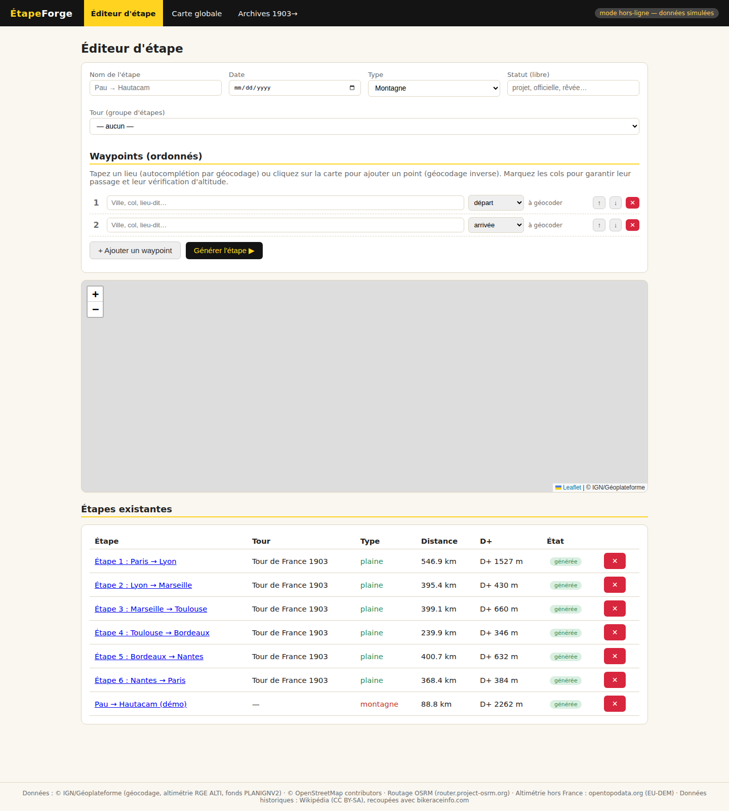
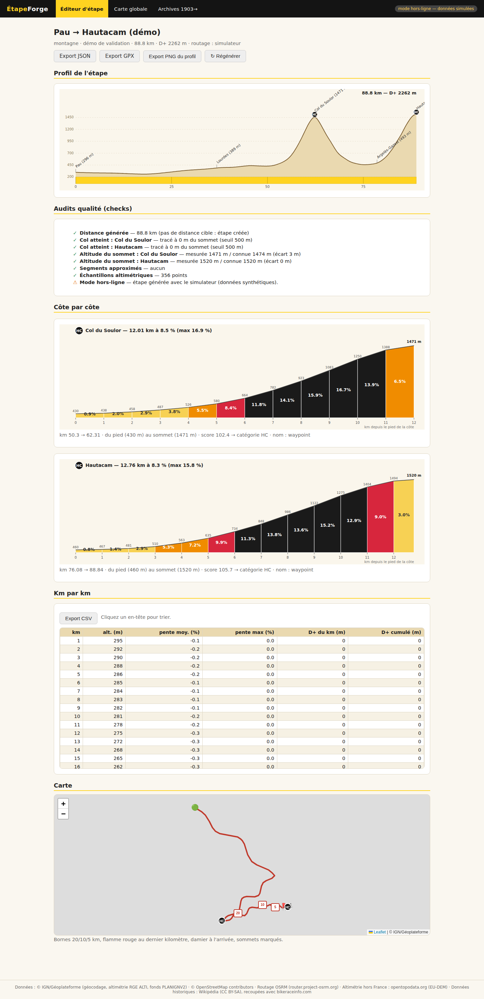
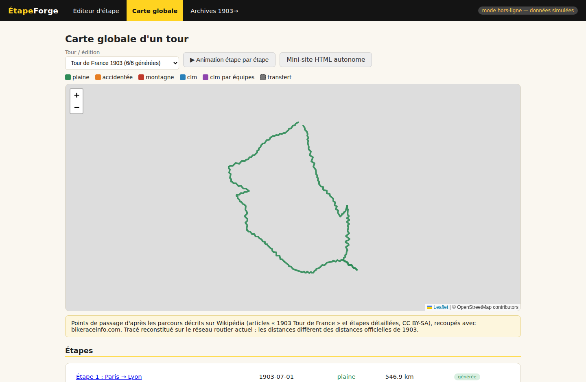
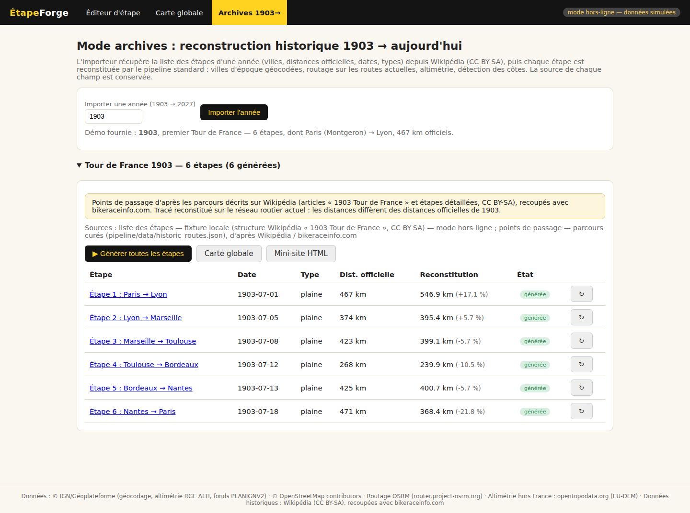
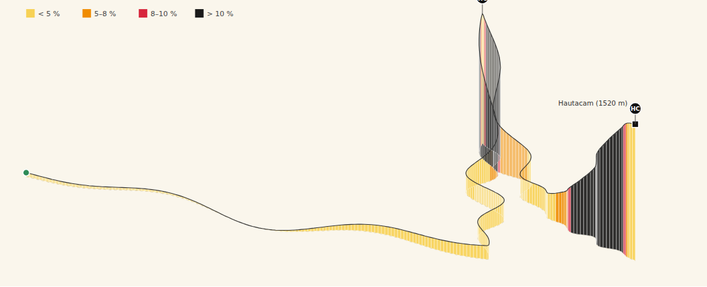
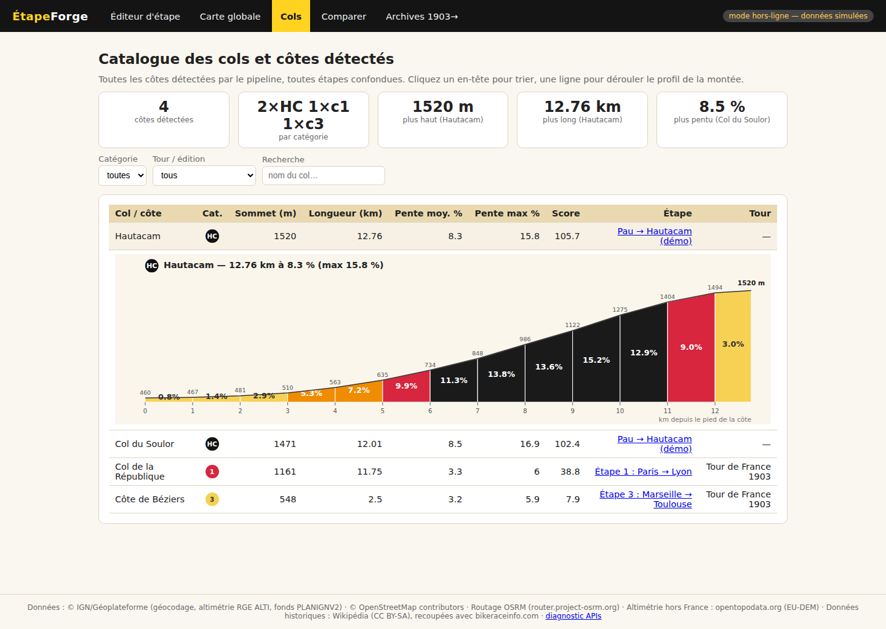
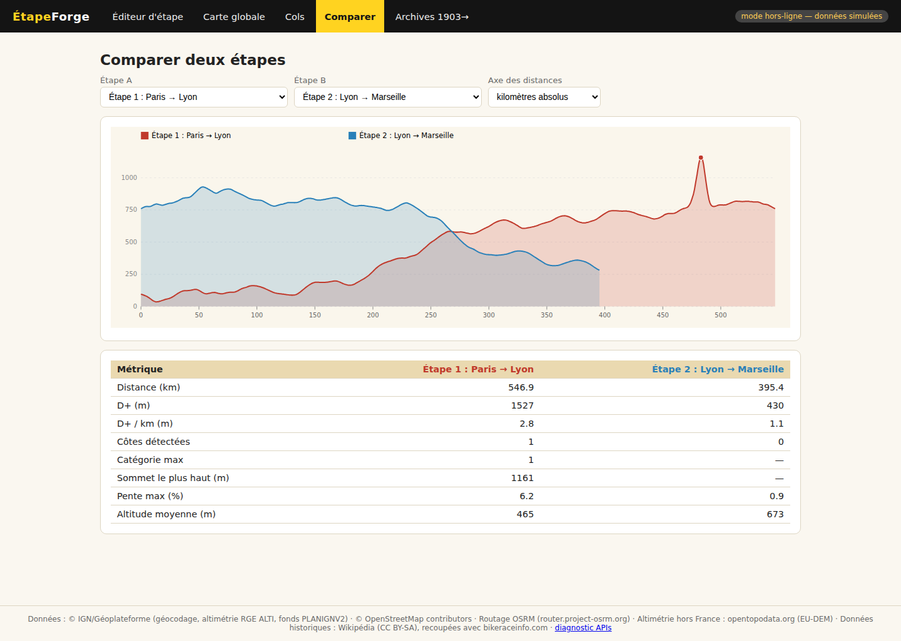
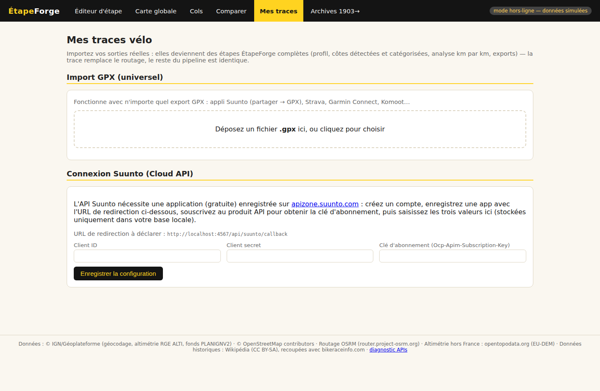

# ÉtapeForge


**Générateur d'étapes du Tour de France** — application web 100 % locale : Node.js + SQLite +
Leaflet/SVG. Aucun compte, aucune dépendance cloud propriétaire.

Positionnement : ce que [la-flamme-rouge.eu](https://la-flamme-rouge.eu) ne fait pas —
**reconstruction historique 1903→2027**, **fiches côte-par-côte automatiques**,
**analyse km par km**, **exports JSON/GPX/PNG/HTML**, **audits de qualité** par étape.

## Prérequis : Node.js installé

Les 3 commandes ci-dessous supposent que [Node.js](https://nodejs.org/) (version
20 ou plus récente) est déjà installé. Pas développeur et jamais installé Node ?

1. Téléchargez la version « LTS » sur [nodejs.org](https://nodejs.org/) (bouton
   principal de la page d'accueil) et lancez l'installeur — Windows, macOS et Linux.
2. Vérifiez l'installation dans un terminal (invite de commandes) :
   ```bash
   node --version   # doit afficher v20 ou plus
   npm --version
   ```
3. Erreur `npm: command not found` (ou `'npm' n'est pas reconnu…` sous Windows) :
   l'installation n'a pas abouti ou le terminal a été ouvert avant l'install —
   fermez et rouvrez le terminal, ou redémarrez la machine.

## Démarrage en 3 commandes

```bash
npm install
npm run demo     # génère et vérifie la démo (Pau→Hautacam + Tour 1903 complet)
npm start        # http://localhost:4567
```

> `npm run demo` tourne par défaut en **mode hors-ligne** (simulateur déterministe,
> reproductible partout, données synthétiques clairement étiquetées). Avec accès
> internet, `node scripts/demo.js --online` utilise les vraies APIs (Géoplateforme,
> OSRM, opentopodata, Wikipédia). Le serveur, lui, utilise les vraies APIs par
> défaut ; lancez `ETAPEFORGE_OFFLINE=1 npm start` pour rester sur le simulateur.

## Les 4 écrans principaux

(la barre de navigation en compte 6 au total — Cols et Comparer, présentés
plus bas dans « Visualisations inspirées de VeloViewer », s'ajoutent à ces 4.)

| | |
|---|---|
| **1. Éditeur d'étape** — formulaire (nom, date, type, statut libre), waypoints ordonnés avec autocomplétion géocodage, carte de prévisualisation (ajout d'un waypoint par clic → géocodage inverse), bouton « Générer » → pipeline → fiche.  | **2. Fiche d'étape** — profil SVG style ASO (silhouette sable lissée, annotations obliques des villes/cols à leur km réel, pastilles de catégorie HC/1/2/3/4, bande jaune kilométrique, D+, distance), section **côte par côte** (profil zoomé en blocs de 1 km colorés par pente, % affiché), section **km par km** (tableau triable + export CSV), mini-carte IGN PLANIGNV2/OSM avec bornes 20/10/5 km, flamme rouge, damier, sommets.  |
| **3. Carte globale interactive** — tous les tracés d'un tour, couleur par type d'étape, transferts en pointillés, popup par étape avec profil miniature, filtre par édition, animation étape par étape.  | **4. Mode archives 1903→aujourd'hui** — import de la liste des étapes d'une année depuis Wikipédia (CC BY-SA), reconstruction par le pipeline standard, affichage « tracé reconstitué sur le réseau routier actuel — distance officielle X km / reconstitution Y km (écart %) ». 1903 livré complet en démo.  |

## Visualisations inspirées de VeloViewer

En plus du profil 2D style ASO, la fiche d'étape propose des visualisations
inspirées de [VeloViewer](https://veloviewer.com) (le site de référence pour
la visualisation de cols, utilisé jusque dans les retransmissions TV) :

- **Profil 3D interactif** (onglet « Profil 3D » de la fiche) : le tracé est
  projeté en perspective et extrudé selon l'altitude, chaque tranche colorée
  par la pente locale (jaune < 5 %, orange 5–8 %, rouge 8–10 %, noir > 10 %).
  **Glissez pour pivoter** la vue, ajustez l'**étirement du relief** au curseur.
  
- **Tracé coloré par pente sur la carte** : chaque segment du parcours est teinté
  selon sa pente (survol → km, altitude, %).
- **Tableau de statistiques dense et triable** sur la carte globale : km
  officiels/reconstitués, écart, D+, nombre de côtes, catégorie max, pente max,
  toit de l'étape — avec tuiles de totaux (distance, D+, côtes par catégorie,
  toit du tour).
- **Catalogue des cols** (`/cols.html`) : toutes les côtes détectées, toutes
  étapes confondues — liste triable et filtrable (catégorie, édition,
  recherche), profil de la montée déroulable par ligne, records (plus haut,
  plus long, plus pentu). 
- **Comparateur d'étapes** (`/compare.html`) : superposition des profils de
  deux étapes (axe en km absolus ou en % de l'étape) + tableau de métriques
  côte à côte (D+/km, catégorie max, pente max, altitude moyenne…).
  

## Architecture

```
backend/    Express + better-sqlite3 — API REST + frontend statique
            tables : editions, stages, waypoints, tracks (GeoJSON),
            elevation_samples, climbs, km_analysis,
            geocode_cache, elevation_cache, api_cache
pipeline/   modules réutilisables (géocodage, routage, altimétrie, détection
            de côtes, analyse km/km, checks, importeur Wikipédia) + CLI
frontend/   vanilla JS + Leaflet (servi localement) + SVG maison (profile.js,
            partagé avec l'export HTML autonome). Aucun framework lourd.
scripts/    demo.js — démo de validation auto-vérifiée
test/       node:test — détecteur de côtes (profils synthétiques) + parseur
            Wikipédia (fixtures 1903, 2025, 2026)
```

**Tout appel externe passe par un cache SQLite** (clé = sha256 de la requête
normalisée) : on ne géocode et n'échantillonne jamais deux fois la même chose.
Chaque hôte a sa file d'attente avec délai minimal (rate limiting).

## Pipeline de génération (identique pour étape créée ou historique)

1. **Géocodage** — France : `data.geopf.fr/geocodage/search` ; hors France :
   Nominatim (User-Agent dédié, max 1 req/s). Les cols sont géocodés au sommet
   et leur altitude vérifiée par altimétrie.
2. **Routage** — OSRM public (`router.project-osrm.org`, driving,
   `geometries=geojson`, `overview=full`), leg par leg (cache par paire de
   waypoints). Si un col est contourné (tracé > 500 m du sommet), routage
   jusqu'au pied puis interpolation pied→sommet, segment marqué « approximé ».
3. **Altimétrie** — échantillonnage tous les 100 m (étapes < 60 km) ou 250 m
   (au-delà). France : `data.geopf.fr/altimetrie` (ressource `ign_rge_alti_wld`,
   paquets de 150 points). Ailleurs : `api.opentopodata.org/v1/eudem25m`
   (100 pts/req, 1 req/s). Stockage **brut + lissé** (moyenne glissante 1 500 m).
4. **Détection des côtes** — segment continu ≥ 1,5 km à ≥ 3 % de moyenne, fusion
   si replat < 500 m. Catégorisation approx ASO : `score = longueur_km × pente_moy_%`
   → > 80 HC, > 32 cat. 1, > 16 cat. 2, > 6 cat. 3, sinon cat. 4. Nom = waypoint
   « col » le plus proche du sommet, sinon toponyme géocodé inverse.
5. **Analyse km par km** — pour chaque km : altitude début/fin, pente moyenne,
   pente max sur 100 m (à la résolution d'échantillonnage), D+ cumulé. Stockée
   en base, exportée en JSON/CSV.

## CLI

```bash
npm run generate -- --stage 12          # (re)génère l'étape n° 12
npm run generate -- --edition 1903      # importe puis génère toute l'édition
npm run generate -- --import 1903       # import seul
# options : --offline (simulateur), --force (regénère les étapes déjà faites)
```

## Mode archives

- **Importeur** : liste des étapes (villes départ/arrivée, distance officielle,
  date, type) depuis l'API REST de Wikipédia (`en.wikipedia.org/api/rest_v1`,
  pages « *année* Tour de France », tableaux structurés, CC BY-SA). Source de
  recoupement autorisée : bikeraceinfo.com. **On ne scrape ni letour.fr ni
  lequipe.fr.** La provenance de chaque champ est stockée (`stages.source`,
  `editions.source`).
- **Points de passage curés** (`pipeline/data/historic_routes.json`) : villes
  d'époque et cols connus, avec leur source — fournis pour 1903 (départ réel à
  Montgeron, col du Pin-Bouchain à l'étape 1 — tout premier col de l'histoire
  du Tour, col de la République à l'étape 2 — premier col > 1000 m), 1905
  (Ballon d'Alsace), 1910 (le « Cercle de la mort » : Peyresourde, Aspin,
  Tourmalet, Aubisque), 1911 (premier Galibier), 1952 (première arrivée à
  l'Alpe d'Huez), puis toutes les éditions **2020 à 2026** (étapes reines :
  Loze, doublé du Ventoux, Granon, Spandelles, Markstein, Superbagnères,
  Peyragudes, Toses, Gavarnie, doublé de l'Alpe d'Huez…). Ce fichier ne
  contient que des données réelles/officielles sourcées — voir la démo
  spéculative ci-dessous pour un contre-exemple volontairement hors de ce
  périmètre. Les altitudes des cols qui reviennent d'une édition à l'autre
  (Tourmalet, Galibier…) sont centralisées dans `pipeline/data/known_cols.json`
  plutôt que retapées à chaque occurrence ; un via peut toujours fournir son
  propre `ele` pour prévaloir sur ce référentiel dans un cas particulier. Une
  réserve sur une affirmation précise (ex. « altitude à confirmer ») est
  portée comme métadonnée structurée (`confidence: [{claim, status: OK/FIX/
  UNSURE, level: haute/moyenne/basse, detail?}]` par étape) plutôt que noyée
  dans le texte libre `note` — exposée par `stageConfidence(year, stageNumber)`
  (`pipeline/wikipedia.js`).
- **Reconstruction** : pipeline standard sur le réseau routier actuel — la fiche
  affiche « tracé reconstitué sur le réseau routier actuel — distance officielle
  *année* : X km / reconstitution : Y km (écart %) ».
- **Fixtures hors-ligne** : 1903 (complète), 2025 (complète), 2026 (partielle —
  snapshot du parcours annoncé, capturé avant la course ; l'édition 2026 est
  en réalité terminée depuis le 26 juillet 2026, voir les étapes reines
  curées avec résultats dans `historic_routes.json`). Toute autre année
  s'importe en ligne.

## Garde-fous et qualité

- Rate limits respectés (files d'attente par hôte) ; progression affichée pour
  les longues générations (une étape de 467 km ≈ 1 900 points d'altimétrie).
- Bloc **checks** par étape : distance reconstituée vs cible (±25 %), cols
  atteints (< 500 m), altitudes de sommets vs valeurs connues, segments
  approximés listés, échantillons manquants.
- **Attributions affichées** dans l'application et les exports :
  IGN/Géoplateforme, © OpenStreetMap contributors, OSRM, opentopodata,
  Wikipédia (CC BY-SA) pour les données historiques.
- **Mode hors-ligne** : simulateur déterministe (gazetier de lieux réels +
  modèle de terrain calibré sur les altitudes connues des sommets) — le reste
  du pipeline est strictement identique ; les fiches portent l'avertissement
  « données simulées ».

## Mes traces : import GPX et connexion Suunto

L'écran **« Mes traces »** (`/traces.html`) transforme vos sorties réelles en
étapes ÉtapeForge complètes (profil, côtes détectées/catégorisées, km par km,
exports) — la trace remplace le routage, le reste du pipeline est identique :

- **Import GPX universel** : glissez un fichier `.gpx` (export de l'appli
  Suunto, Strava, Garmin Connect, Komoot…). Les altitudes du fichier sont
  utilisées si présentes, sinon échantillonnées par les fournisseurs
  d'altimétrie. 
- **Connexion Suunto Cloud API** (optionnelle — le GPX suffit dans la plupart
  des cas) : OAuth2 vers votre compte Suunto, liste de vos sorties, import en
  un clic (export FIT décodé côté serveur). Nécessite une application
  (gratuite) enregistrée sur [apizone.suunto.com](https://apizone.suunto.com) ;
  **guide pas-à-pas : [docs/SUUNTO.md](docs/SUUNTO.md)**. Les identifiants
  restent dans votre base locale.

## Éditer une étape existante

Chaque fiche a un bouton **« ✎ Modifier l'étape »** (ou `/?id=<n>`) : le
formulaire et les waypoints sont préchargés, « Mettre à jour et régénérer »
relance le pipeline. L'éditeur permet aussi de créer un **tour personnalisé**
à la volée (« + nouveau tour… ») pour grouper des étapes sur la carte globale.

## Démo interactive GitHub Pages

Le workflow `pages.yml` publie automatiquement (à chaque push sur `main`) la
**démo interactive** sur https://opaland.github.io/Tdf-generator/ : l'application
frontend complète (fiches avec profil 3D, carte globale, cols, comparateur…)
branchée sur des données pré-générées **avec les vraies APIs** (routage OSRM sur
le réseau routier réel, altimétrie IGN) — repli automatique sur le simulateur
hors-ligne si une API est indisponible, avec étiquetage du mode utilisé. La
création d'étapes reste réservée à la version locale (`npm start`).

## NAS Synology / Docker

`Dockerfile` + `docker-compose.yml` durcis (conteneur non-root, lecture seule,
un seul volume monté pour la base — aucun accès aux autres fichiers du NAS) ;
accès distant recommandé via Tailscale, **sans exposer de port sur Internet**.
**Guide pas-à-pas : [docs/SYNOLOGY.md](docs/SYNOLOGY.md)**. L'image est
construite et smoke-testée en CI à chaque push.

## Mode public (comptes email/mot de passe)

Par défaut, ÉtapeForge n'a **aucun compte** — c'est l'usage prévu en local ou
sur un NAS en réseau privé. Pour une exposition publique sur Internet (VPS),
un mur d'accès optionnel existe : `ETAPEFORGE_PUBLIC=1` active des comptes
email/mot de passe (hachage `crypto.scrypt`, sessions par cookie `httpOnly`).
**Important : les données restent partagées entre tous les comptes** (ce
n'est pas un cloisonnement multi-utilisateur) — voir les détails et la mise
en garde dans **[docs/DEPLOY-PUBLIC.md](docs/DEPLOY-PUBLIC.md)** avant
d'activer ce mode.

## Diagnostic du mode réel

La page **/diag.html** (lien en pied de page) teste la connectivité vers chaque
API externe (Géoplateforme géocodage + altimétrie, OSRM, Nominatim,
opentopodata, Wikipédia) avec latence et détail d'erreur — pratique avant une
grosse génération, ou pour comprendre pourquoi le mode réel échoue derrière un
proxy. En cas de réseau indisponible, tout fonctionne en mode hors-ligne :
`ETAPEFORGE_OFFLINE=1 npm start`.

## Exports

- **JSON** complet par étape (`/api/stages/:id/export.json`)
- **GPX** du tracé (`/api/stages/:id/export.gpx`) — les sommets des côtes
  détectées y figurent comme waypoints nommés (catégorie, pente)
- **PNG** du profil (rendu SVG → canvas, bouton sur la fiche)
- **CSV** du km par km (bouton sur la fiche)
- **Page HTML autonome par tour** (`/api/editions/:id/export.html`) — mini-site
  avec carte et profils embarqués

## Tests

```bash
npm test              # node:test — pipeline, sécurité, parseur historique
npm run lint           # ESLint (eslint:recommended) — erreurs réelles, pas de style
npm audit --audit-level=high
```

- détecteur de côtes sur profils synthétiques connus (détection, fusion < 500 m,
  seuils, catégorisation, blocs de 1 km) ;
- parseur Wikipédia sur les fixtures 1903 (6 étapes, 2 428 km), 2025 (21 étapes,
  types CLM/montagne, entités accentuées) et 2026 (partielle) ;
- géocodage réseau (repli Géoplateforme → Nominatim, aucun résultat nulle part) —
  mock HTTP local, aucun vrai appel externe.

Les trois commandes tournent en CI (`.github/workflows/ci.yml`, jobs `test` et
`lint`) à chaque push et pull request.

## Démo de validation finale (`npm run demo`)

1. **Étape créée** : Pau → Hautacam via Lourdes, col du Soulor, Argelès-Gazost —
   Soulor et Hautacam détectés et catégorisés.
2. **Étape historique** : Paris (Montgeron) → Lyon, édition 1903 — distance
   officielle 467 km, écart de reconstitution affiché, col du Pin-Bouchain
   détecté (étape 1, tout premier col de l'histoire du Tour) ; col de la
   République détecté (étape 2 Lyon → Marseille, premier col > 1000 m).
3. **Carte globale** du Tour 1903 complet (6 étapes).

Chaque point est vérifié automatiquement ; le script sort en erreur si une
vérification échoue.

`npm run demo:online` lance la même démo avec les vraies APIs (Géoplateforme,
OSRM, opentopodata, Wikipédia) au lieu du simulateur hors-ligne. `pages.yml`
l'exécute déjà à chaque push sur main, mais avec un repli silencieux sur le
simulateur en cas d'échec — volontaire là-bas, pour ne jamais bloquer le
déploiement du site sur un aléa réseau. Un job GitHub Actions nocturne séparé
(`.github/workflows/demo-online.yml`), sans repli, la relance chaque nuit pour
qu'une vraie régression d'intégration API fasse effectivement échouer un
build.

## Démo spéculative (`npm run demo:2027`)

`scripts/demo-2027.js` génère deux étapes d'un **parcours 2027 imaginé**, à
titre d'exercice algorithmique — **aucun Tour 2027 n'est annoncé à ce jour**
(l'ASO présente le parcours de l'année N+1 en octobre de l'année N). Édition
créée à part (`is_custom`), jamais mélangée aux données sourcées de
`historic_routes.json` :

1. Édimbourg → Carlisle : géocodage hors France (repli Nominatim automatique,
   aucune couverture IGN sur ce tronçon).
2. Val-d'Isère → Sestriere : franchissement France → Italie via le col de
   l'Iseran (2 764 m), le col du Mont-Cenis (2 081 m) et la Colle delle
   Finestre (2 178 m, ascension partiellement non goudronnée) — exerce le
   garde-fou « col difficilement routable → interpolation pied-sommet
   marquée approximée ».

Nécessite `--online` (aucune couverture Royaume-Uni/Italie dans le
simulateur hors-ligne) ; n'est pas un test de non-régression — `npm test` et
`npm run demo` restent les garde-fous requis avant tout commit. Un job GitHub
Actions mensuel (`.github/workflows/demo-2027.yml`) la surveille en continu.

## Monkey testing (`npm run monkey`)

```bash
npm run monkey                              # graine aléatoire (affichée pour rejeu)
MONKEY_SEEDS=42 npm run monkey              # rejoue exactement la même séance
MONKEY_SEEDS=1,2,3 MONKEY_ACTIONS=40 npm run monkey   # plusieurs graines, plus d'actions/page
```

`scripts/monkey.js` déchaîne « Fatiha » (cyclosportive amatrice pressée, pas
développeuse) sur les 8 écrans : clics et remplissages aléatoires (payloads
XSS/injection SQL/unicode/chaînes géantes…), redimensionnements, retours
arrière, rechargements en plein chargement. Chaque séance est **reproductible
par graine** (PRNG déterministe, pas `Math.random()`) : une graine qui trouve
un problème peut être rejouée telle quelle une fois le correctif écrit, pour
vérifier qu'il tient. Échoue (code de sortie non nul) à la moindre erreur JS,
5xx, ou XSS effectivement déclenché.

Exploratoire, **volontairement hors CI** : une trouvaille doit être lue par un
humain puis, si elle est réelle, verrouillée dans un test permanent — c'est
ainsi que les deux bugs de `test/serverFuzz.test.js` ont été trouvés et
corrigés. Dans un environnement au réseau restreint, des erreurs de chargement
de tuiles de carte (CDN, fonds IGN/OSM) sont normales et ne signalent aucune
régression de l'application elle-même.

## Roadmap / contribuer

Ce README décrit ce qui existe. Pour ce qui est envisagé mais pas encore fait,
voir le **[backlog du projet](https://github.com/Opaland/Tdf-generator/issues/10)**
(idées groupées par thème : rigueur des données, couverture historique,
algorithmes, UX, infra, tests — sans engagement de calendrier).

## Les documents du projet

Ils se lisent dans cet ordre — chacun répond à une question différente, et
aucun ne recopie les autres (même principe que chez
[Rando-generator](https://github.com/Opaland/Rando-generator), le dépôt
cousin dont plusieurs idées de ce README/backlog sont directement reprises).

| Document | La question à laquelle il répond |
|---|---|
| [`docs/BRIEF.md`](./docs/BRIEF.md) | Quel problème, pour qui, contre qui — et **ce qu'on ne fera pas** |
| [`docs/PRD.md`](./docs/PRD.md) | Dans quel ordre avancer, et à quoi voit-on qu'un sujet est fini |
| [`docs/PERSONAS.md`](./docs/PERSONAS.md) | Six personnes suivies pas à pas, et l'endroit exact où elles s'arrêtent |
| [`docs/DESIGN_SYSTEM.md`](./docs/DESIGN_SYSTEM.md) | Couleurs, espacement, boutons — et **pourquoi certaines duplications ne doivent pas être « corrigées »** |
| [`CLAUDE.md`](./CLAUDE.md) | Les règles de travail qu'aucune machine ne vérifie — chacune vient d'un raté réel, daté |
| [issue #10](https://github.com/Opaland/Tdf-generator/issues/10) | Le backlog détaillé, par thème |
| [issue #14](https://github.com/Opaland/Tdf-generator/issues/14) | L'étude concurrentielle — contre qui, quelles idées en retenir |

## Outils Claude Code du dépôt (`.claude/`)

Pour qui développe ici avec Claude Code : trois skills (`/porte` avant PR,
`/revue-sprint` après chaque tâche, `/revue-globale` en fin de session) et
deux agents (`relecteur-adverse`, `verificateur-de-tests`) — détaillés dans
`CLAUDE.md` et `.claude/`. Un hook `PreToolUse` lance `npm test` avant
chaque `git commit` ; un hook `SessionStart` rapporte l'état de la CI sur
`main` au démarrage.

## Licences

Code sous licence [MIT](./LICENSE). Certaines données embarquées (import
Wikipédia dans `pipeline/data/historic_routes.json`) restent sous leur
licence d'origine (CC BY-SA), distincte du code — détails dans
**[`NOTICE.md`](./NOTICE.md)**.
